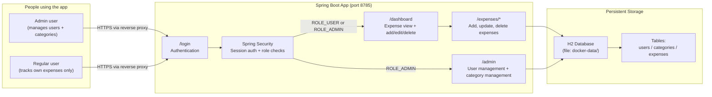
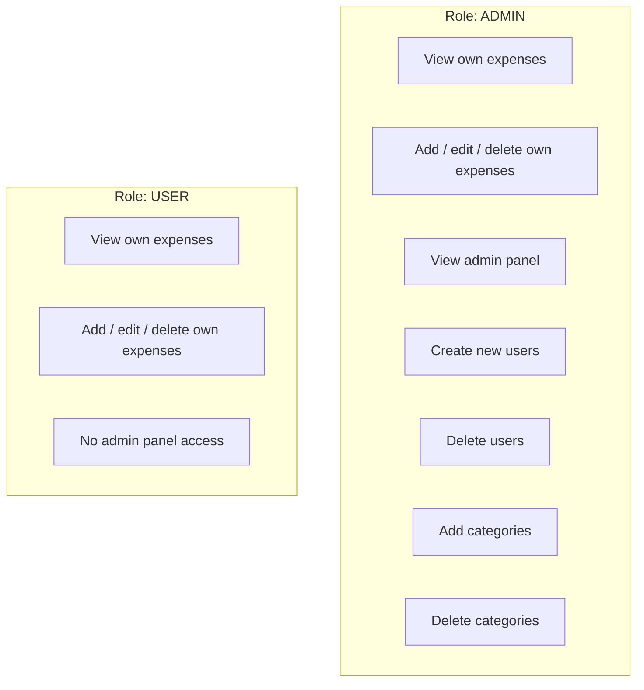
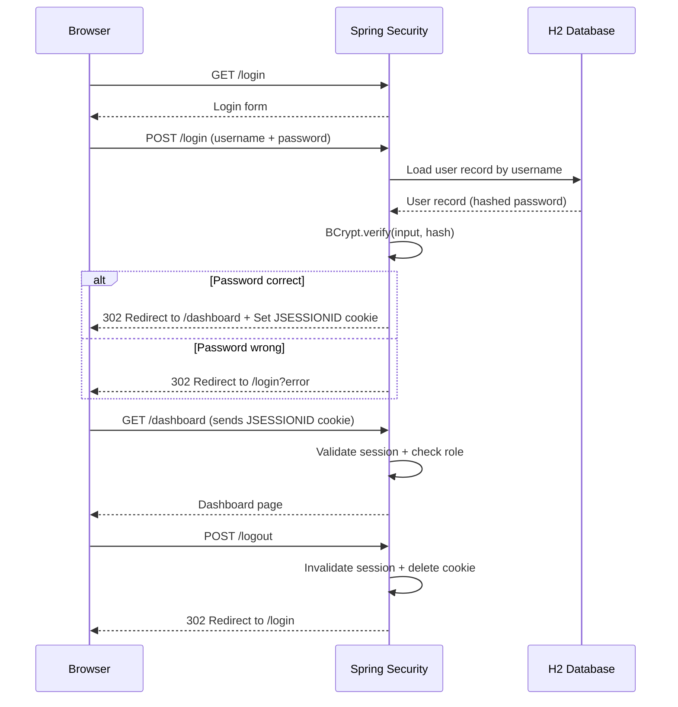
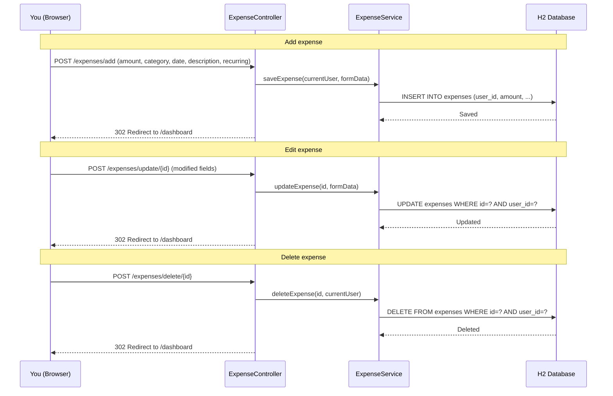
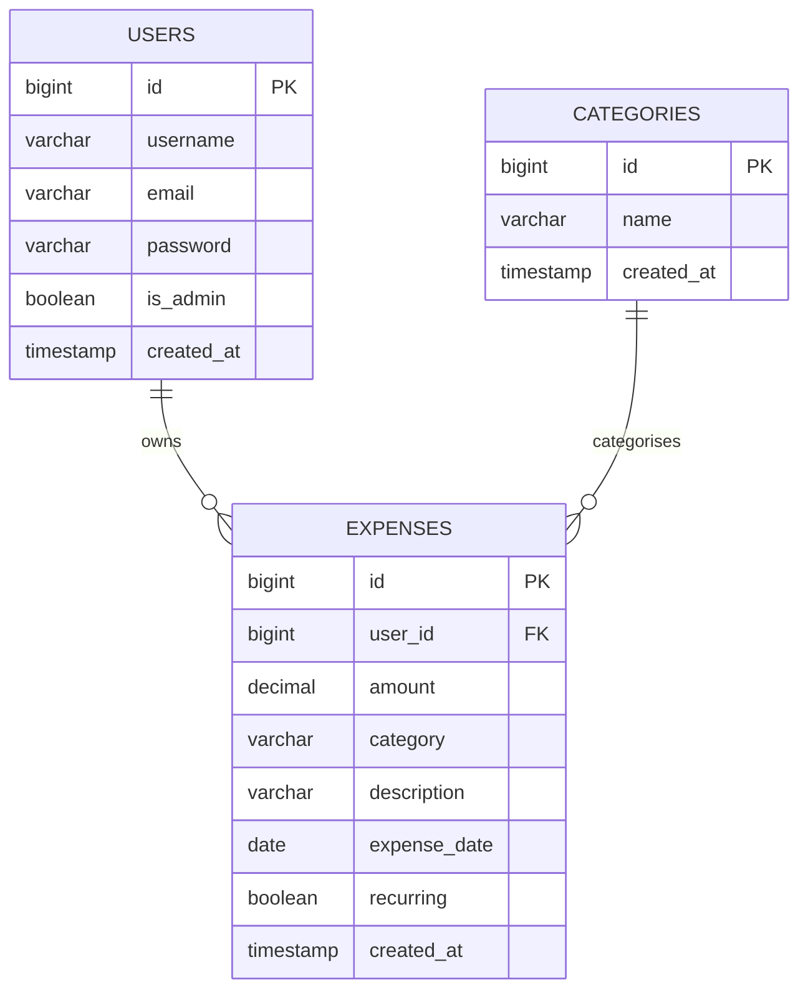
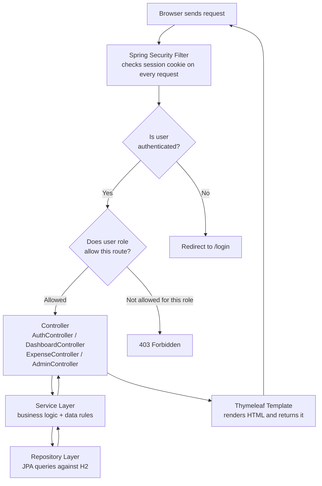

# TrackMyStacks

A self-hosted personal finance tracker built with Spring Boot.
Track expenses, manage categories, and control users from a web interface.
No cloud accounts. No subscriptions. Your data stays on your machine.

---

## The one thing you need to know

| What | URL |
|---|---|
| Login page | `http://localhost:8785/login` |
| Main dashboard (after login) | `http://localhost:8785/dashboard` |
| Admin panel (admin only) | `http://localhost:8785/admin` |

Default credentials on first run:

```
Username: admin
Password: admin123
```

> Change the admin password immediately after first login.

---

## How the application works — big picture



---

## Who can do what — role comparison



Key rule: **Users only ever see their own expenses.** An admin can access the admin panel but their expense data is still isolated to their own account.

---

## Login and session flow



---

## Expense lifecycle — what happens when you add, edit, or delete



---

## Database schema — tables and relationships



Notes:
- `EXPENSES.user_id` links each expense to exactly one user
- `CATEGORIES` is global — all users share the same list, only admins can modify it
- Deleting a category does **not** delete expenses that used it — the name is stored as a string directly on the expense row

---

## How a request travels through the app



---

## Component map — what each file does

```mermaid
flowchart LR
    subgraph CONFIG["config/"]
        SC["SecurityConfig.java\n- Which routes need auth\n- Login + logout URL config\n- BCrypt password encoder\n- Session rules"]
        DI["DataInitializer.java\n- Runs once on startup\n- Creates default admin user\n- Creates default categories"]
    end

    subgraph CONTROLLERS["controller/"]
        AC["AuthController.java\nGET /login"]
        DC["DashboardController.java\nGET /dashboard\nLoads expenses + categories"]
        EC["ExpenseController.java\nPOST /expenses/add\nPOST /expenses/update/{id}\nPOST /expenses/delete/{id}"]
        ADC["AdminController.java\nGET /admin\nPOST /admin/create-user\nPOST /admin/delete-user/{id}\nPOST /admin/create-category\nPOST /admin/delete-category/{id}"]
    end

    subgraph SERVICES["service/"]
        ES["ExpenseService.java\nExpense CRUD + ownership enforcement"]
        US["UserService.java\nCreate/delete users + BCrypt encoding"]
        CS["CategoryService.java\nAdd/delete categories"]
        CU["CustomUserDetailsService.java\nLoads user from DB for Spring Security"]
    end

    subgraph MODELS["model/"]
        UM["User.java\nid, username, email\npassword (hashed), isAdmin"]
        EM["Expense.java\nid, userId, amount\ncategory, description\nexpenseDate, recurring"]
        CM["Category.java\nid, name"]
    end

    subgraph REPOS["repository/"]
        UR["UserRepository.java"]
        ER["ExpenseRepository.java"]
        CR["CategoryRepository.java"]
    end

    subgraph TEMPLATES["templates/"]
        LT["login.html\nLogin form + animated background"]
        DT["dashboard.html\nExpense table (desktop)\nExpense cards (mobile)\nAdd form + edit modal"]
        AT["admin/panel.html\nUser list + create/delete\nCategory list + create/delete"]
    end

    CONTROLLERS --> SERVICES
    SERVICES --> REPOS
    REPOS --> MODELS
    CONTROLLERS --> TEMPLATES
    CONFIG --> CONTROLLERS
```



---

## Project file map

```text
TrackMyStacks/
|
+-- docker-compose.yml              <- Start/stop/build the app here
+-- Dockerfile                      <- How the container image is built
+-- pom.xml                         <- Java dependencies (Spring Boot, H2, etc.)
|
+-- docker-data/                    <- PERSISTED (created automatically by Docker)
|   +-- trackmystacks.mv.db         <- H2 database (all data lives here)
|
+-- src/main/
    +-- java/com/sohaib/trackmystacks/
    |   |
    |   +-- TrackMyStacksApplication.java   <- Main entry point (do not touch)
    |   |
    |   +-- config/
    |   |   +-- SecurityConfig.java         <- Route protection, login/logout config
    |   |   +-- DataInitializer.java        <- Default admin + categories on first run
    |   |
    |   +-- controller/
    |   |   +-- AuthController.java         <- /login page
    |   |   +-- DashboardController.java    <- /dashboard page
    |   |   +-- ExpenseController.java      <- /expenses/* (add, edit, delete)
    |   |   +-- AdminController.java        <- /admin page (users + categories)
    |   |
    |   +-- model/
    |   |   +-- User.java                   <- User data shape
    |   |   +-- Expense.java                <- Expense data shape
    |   |   +-- Category.java               <- Category data shape
    |   |
    |   +-- repository/
    |   |   +-- UserRepository.java         <- DB queries for users
    |   |   +-- ExpenseRepository.java      <- DB queries for expenses
    |   |   +-- CategoryRepository.java     <- DB queries for categories
    |   |
    |   +-- service/
    |       +-- UserService.java                <- User create/delete + password hash
    |       +-- ExpenseService.java             <- Expense CRUD + ownership check
    |       +-- CategoryService.java            <- Category add/delete
    |       +-- CustomUserDetailsService.java   <- Plugs users into Spring Security
    |
    +-- resources/
        +-- application.properties          <- Port, DB path, Thymeleaf settings
        +-- templates/
            +-- login.html                  <- Login page
            +-- dashboard.html              <- Main expense view (responsive)
            +-- admin/
                +-- panel.html              <- Admin management page
```

---

## Quick start

### Option A — Docker (recommended)

```bash
cd TrackMyStacks

# Build image and start container
docker compose up -d --build

# Watch startup logs
docker compose logs -f

# Open in browser
http://localhost:8785/login
```

### Option B — Local Maven (no Docker)

```bash
cd TrackMyStacks
mvn spring-boot:run

# Open in browser
http://localhost:8785/login
```

Requirements for Option B: Java 17+, Maven 3.6+

---

## Data persistence

```
docker-compose.yml maps:
  ./docker-data  ->  /app/data  (inside the container)

Database file: ./docker-data/trackmystacks.mv.db
```

> If you delete `docker-data/`, all users, expenses, and categories are wiped.
> The default admin account and default categories will be recreated on next startup.

---

## Default categories (pre-loaded on first run)

```
Food  |  Transport  |  Entertainment  |  Bills  |  Shopping  |  Health  |  Tech  |  Other
```

Admins can add or remove categories from the admin panel at any time.
Removing a category does **not** delete expenses that were tagged with it.

---

## All routes

```
Public (no login needed):
  GET  /login                          Login form
  POST /login                          Submit credentials
  POST /logout                         End session

Authenticated (any logged-in user):
  GET  /                               Redirects to /dashboard
  GET  /dashboard                      Your expenses
  POST /expenses/add                   Add a new expense
  POST /expenses/update/{id}           Edit an existing expense
  POST /expenses/delete/{id}           Delete an expense

Admin only (ROLE_ADMIN required):
  GET  /admin                          Admin panel
  POST /admin/create-user              Create a new user
  POST /admin/delete-user/{id}         Delete a user
  POST /admin/create-category          Add a category
  POST /admin/delete-category/{id}     Remove a category
```

---

## Useful Docker commands

```bash
# Start app (builds if no image exists)
docker compose up -d --build

# Stop app
docker compose down

# View live logs
docker compose logs -f

# Restart without rebuild
docker compose restart

# Rebuild after code changes
docker compose up -d --build

# Open a shell inside the container
docker exec -it trackmystacks-app sh

# Check the app is responding
curl http://localhost:8785/login
```

---

## Troubleshooting

### Port 8785 is already in use
Change the left-side port in `docker-compose.yml`:
```yaml
ports:
  - "8786:8785"
```

### Forgot admin password / locked out
```bash
docker compose down
rm -rf docker-data/
docker compose up -d --build
# Recreates admin/admin123 from scratch
```

### Database locked error
```bash
docker compose down
rm -f docker-data/trackmystacks.trace.db
docker compose up -d
```

### Schema error / column not found after an update
```bash
docker compose down
rm -rf docker-data/
docker compose up -d --build
```

### Categories not showing in expense form
- Go to `/admin` and verify at least one category exists
- Hard refresh: `Ctrl + Shift + R`

### Edit modal not opening
- Open browser console (`F12`) and check for JavaScript errors
- Make sure the page fully loaded before clicking Edit

---

## H2 database console (development only)

Direct SQL browser for debugging:

```
URL:       http://localhost:8785/h2-console
JDBC URL:  jdbc:h2:file:/app/data/trackmystacks
Username:  sa
Password:  (leave blank)
```

Disable before production:
```properties
spring.h2.console.enabled=false
```

---

## Security summary

| Area | Current setting |
|---|---|
| Password storage | BCrypt hashed — plain text never stored |
| Session authentication | Cookie-based (JSESSIONID) |
| Route protection | Spring Security filter on every request |
| Admin routes | Requires ROLE_ADMIN |
| Public user signup | Disabled — admin must create all accounts |
| CSRF | Disabled (re-enable for production) |
| Expense data isolation | Users can only read/write their own expenses |
| H2 console | Enabled (disable before going public) |

---

## Production checklist

Before exposing this to the internet:

1. Change the default admin password
2. Set `spring.h2.console.enabled=false` in `application.properties`
3. Enable CSRF in `config/SecurityConfig.java`
4. Put a reverse proxy (Nginx Proxy Manager, Caddy, etc.) in front with HTTPS/SSL
5. Consider migrating from H2 to PostgreSQL or MySQL for heavier use
6. Set up regular backups of `docker-data/`

---

## Backup and restore

```bash
# Backup
tar -czf trackmystacks-backup-$(date +%Y%m%d).tar.gz docker-data/

# Restore
docker compose down
tar -xzf trackmystacks-backup-YYYYMMDD.tar.gz
docker compose up -d
```

---

## For developers — where to look for what

| Need to change | File |
|---|---|
| Which routes require login or admin | `config/SecurityConfig.java` |
| Default admin user or default categories | `config/DataInitializer.java` |
| Login page appearance | `templates/login.html` |
| Dashboard layout, expense table, edit modal | `templates/dashboard.html` |
| Admin panel layout | `templates/admin/panel.html` |
| Expense add/edit/delete logic | `controller/ExpenseController.java` + `service/ExpenseService.java` |
| User creation/deletion | `controller/AdminController.java` + `service/UserService.java` |
| Category management | `controller/AdminController.java` + `service/CategoryService.java` |
| Port, DB path, Thymeleaf config | `src/main/resources/application.properties` |
| Docker volumes and port mapping | `docker-compose.yml` |